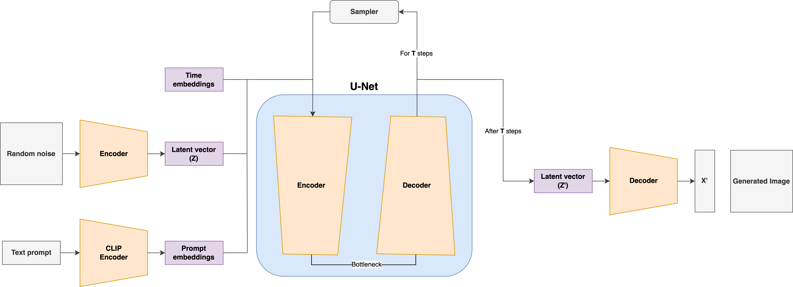

# pytorch-stable-diffusion

---

This repository is a PyTorch implementation of Stable Diffusion from scratch.

## How to use?

### Download & Save the models weights and tokenizer files

---

1. Download the `vocab.json` and `merges.txt` files which is required by the tokenizer from the Stable Diffusion's HuggingFace repository [here](https://huggingface.co/runwayml/stable-diffusion-v1-5/tree/main/tokenizer).
2. Download the `v1-5-pruned-emaonly.ckpt` which contains the model weights for Stable Diffusion [here](https://huggingface.co/runwayml/stable-diffusion-v1-5/tree/main).

Create a `data` folder in the root directory of the project and save the tokenizer files and model weights there.

### Run the `demo.ipynb`

---

This notebook contains some hyperparameters configurations. Feel free to experiment them.

The `generate` function from the `pipeline` module generates an image based on the given prompt.

For image-to-image tasks, the **input image** must be provided. An example image is given in the `images` folder.

## Additional Resources

### Tested fine-tuned models

---

Just download the `ckpt` file from any fine-tuned Stable Diffusion (up to v1.5).

1. [InkPunk Diffusion](https://huggingface.co/Envvi/Inkpunk-Diffusion/tree/main)
2. [Illustration Diffusion (Hollie Mengert)](https://huggingface.co/Envvi/Inkpunk-Diffusion/tree/main)
